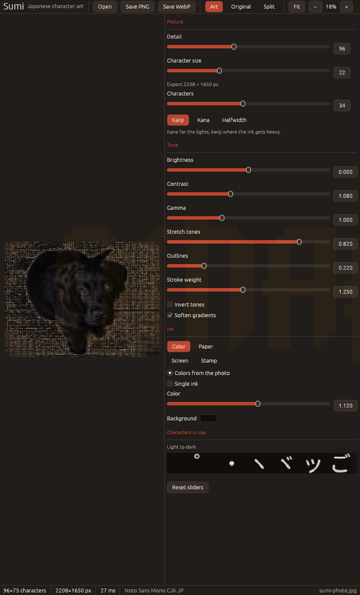

# Sumi

Sumi turns a picture into Japanese character art and saves it as a PNG or a WebP.



Open a photo, move the sliders, and the preview redraws. Detail controls how many characters fit across the picture. Character size controls how large those characters are in the file you save. WebP is written lossless so the strokes stay sharp.

## Run the window

Sumi needs a Japanese font. On Arch and Omarchy:

```bash
sudo pacman -S noto-fonts-cjk
cargo run --release
```

You can also open a file directly:

```bash
cargo run --release -- ~/Pictures/photo.jpg
```

Drop a photo on the window, or use Open. Scroll over the picture to zoom, drag to pan, and double-click to fit it again.

| Action | Shortcut |
| --- | --- |
| Open | Ctrl+O |
| Save PNG | Ctrl+S |
| Save WebP | Ctrl+Shift+S |
| Fit | Ctrl+0 |

The character sets are:

- **Kanji** — kana in the lights, denser kanji as the ink gets heavier
- **Kana** — hiragana and katakana
- **Halfwidth** — narrow katakana, the old terminal look

Presets change the ink and the background without resetting the detail sliders. Color samples the photo. Paper, Screen, and Stamp use one ink color.

## Save from the command line

```bash
cargo run --release -- render photo.jpg photo-sumi.png --columns 120 --style kanji
cargo run --release -- render photo.jpg photo-sumi.webp --preset paper --flat
```

`--flat` keeps smooth areas as one character instead of dithering them. `--mono` uses a single ink color. `--style` is `kanji`, `kana`, or `halfwidth`. `--preset` is `color`, `paper`, `screen`, or `stamp`.

If the font is somewhere else, point Sumi at it. A collection needs the face index after `#`:

```bash
SUMI_FONT=/path/to/NotoSansCJK-Regular.ttc#5 cargo run --release
```

Face 5 of Noto Sans CJK Regular is Noto Sans Mono CJK JP.
